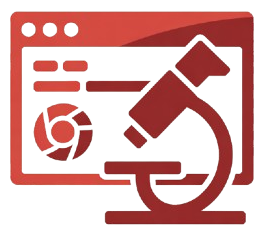

# BrowserScope

<div align="center">


*A comprehensive browser extension for testing organizational security postures against real-world web threats*

[](https://opensource.org/licenses/MIT)
[](https://chrome.google.com/webstore)
[](https://github.com)

</div>

## Important Legal Disclaimer

This repository contains security research tools intended **strictly for educational and research purposes**. These tools demonstrate potential security vulnerabilities in browser extensions to help developers and security professionals better understand and defend against such threats.

**LEGAL NOTICE**: Any use of these tools to actually intercept credentials, hijack sessions, or compromise user identities is unauthorized and may be illegal. Users of this repository must:
- Only test on systems they own or have explicit written permission to test
- Ensure their usage complies with all applicable laws and regulations
- Never use these tools against real users or production systems
- Understand that unauthorized interception of credentials is illegal

The developers assume no liability for misuse. This software is provided as-is for educational purposes only.


## Overview

The BrowserScope is a comprehensive browser extension that evaluates an organization's protection level against common web-based attacks. It simulates real-world threats across multiple attack vectors to identify security gaps and validate existing controls.

[](https://drive.google.com/file/d/1rOaetRfLMbhLxxdDuzColLhniEHHQp5K/view?usp=sharing)

### Key Features

- **Automated Threat Simulation**: Tests 10 attack scenarios across multiple security categories
- **Comprehensive Reporting**: Detailed analytics with visual charts and risk assessment
- **Browser Fingerprinting**: Collects detailed browser security configuration data

## Security Test Categories

- Data Leakage Prevention
- Identity Attacks
- Known Threat Detection
- Suspicious/Malicious Files
- Web & Content Filtering

## Installation & Setup

### Prerequisites
- Google Chrome browser (version 88+)
- Administrative permissions for extension installation
- Isolated testing environment (recommended)

### Installation Steps

1. **Download the Extension**
   ```bash
   git clone https://github.com/sqrx-research-team-ongoing/Websec_posture.git
   cd browser-posture-scanner
   ```

2. **Load into Chrome**
   - Open Chrome and navigate to `chrome://extensions/`
   - Enable "Developer mode" in the top right
   - Click "Load unpacked" and select the extension directory
   - The extension icon should appear in your toolbar

3. **Verify Installation**
   - Click the extension icon to open the popup
   - You should see the "BrowserScope" interface
   - Verify all test categories are loaded

### Required Permissions

The extension requires the following permissions for comprehensive testing:
- `scripting`: Execute test scenarios on web pages
- `storage`: Store test results and configuration
- `downloads`: Test file download blocking capabilities
- `activeTab`: Interact with current browser tab
- `management`: Analyze installed extensions
- `privacy`: Access browser privacy settings
- `host_permissions`: Test across various domains

## Usage Guide

### Running Security Tests

1. **Open the Extension**
   - Click the extension icon in Chrome toolbar
   - The main dashboard will display available test categories

2. **Select Test Categories**
   - Choose specific categories or select "All" for comprehensive testing
   - Each category shows the number of individual tests included
   - Tests are organized by threat type and impact level

3. **Execute Assessment**
   - Click "Run Tests" to begin the security assessment
   - Tests execute automatically in sequence
   - Progress is displayed in real-time during execution
   - Do not close the popup window during testing

4. **Review Results**
   - Tests complete with pass/fail status for each scenario
   - Detailed reports are generated automatically
   - Results include URLs tested, actions taken, and security findings

### Understanding Test Results

**Pass**: Security control successfully blocked the threat
**Fail**: No protection detected, potential security gap identified

### Generating Reports

- Reports are automatically generated after test completion
- Include executive summaries with risk metrics
- Detailed test-by-test breakdowns with evidence
- Browser configuration and fingerprinting data
- Exportable JSON format for integration with security tools

## Core Components

- **Popup Interface**: User-friendly test selection and monitoring
- **Background Service Worker**: Orchestrates test execution and tab management  
- **Test Engine**: Executes automated security test scenarios
- **Report Generator**: Creates comprehensive security assessment reports
- **Storage Manager**: Handles test results and configuration data
- **Tab Manager**: Manages multiple browser tabs for complex test scenarios

## Privacy & Security

- **No Data Transmission**: All tests run locally, no data sent to external servers
- **Isolated Execution**: Tests run in controlled browser contexts
- **Temporary Storage**: Test data stored locally and can be cleared
- **Audit Trail**: Comprehensive logging of all test activities

## Contributing

We welcome contributions from security professionals and researchers:

1. **Fork the Repository**
2. **Create Feature Branch**
   ```bash
   git checkout -b feature/new-test-scenario
   ```
3. **Add Test Cases**
   - Follow existing test structure in `tests.json`
   - Include detailed descriptions and categories
   - Test thoroughly before submission
4. **Submit Pull Request**
   - Include detailed description of new tests
   - Provide documentation for new features
   - Ensure code follows project standards

## License

This project is licensed under the MIT License - see the [LICENSE](LICENSE) file for details.

## Support & Contact

- **Issues**: [GitHub Issues](https://github.com/sqrx-research-team-ongoing/Websec_posture/issues)

